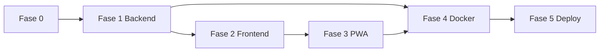

# Figus 2026 — Especificación y plan de desarrollo

> **Documento maestro.** Fuente única de verdad para desarrollar e iterar la app.
> Actualizar este archivo cuando cambien requisitos, decisiones o el plan.

**Última actualización:** 2026-05-19  
**Estado:** Implementado en producción (MVP + búsqueda, banderas, PWA, listado Faltan)  
**Workspace:** `app-figus`  
**URL producción:** https://figus.lionapp.cloud  
**Registro GHCR:** `ghcr.io/lelion13/`

### Documentación del proyecto

| Archivo | Uso |
|---------|-----|
| [FIGUS.md](FIGUS.md) | Spec y decisiones (este archivo) |
| [DEVELOPMENT.md](DEVELOPMENT.md) | Guía día a día: archivos, comandos, nuevas features |
| [RUNBOOK.md](RUNBOOK.md) | Deploy VPS, PWA por plataforma, nginx, troubleshooting |
| [../README.md](../README.md) | Quick start |

---

## Tabla de contenidos

1. [Resumen](#1-resumen)
2. [Decisiones cerradas (Q&A)](#2-decisiones-cerradas-qa)
3. [Fuera de alcance](#3-fuera-de-alcance)
4. [Formato del Excel (fuente de verdad)](#4-formato-del-excel-fuente-de-verdad)
5. [Modelo de datos](#5-modelo-de-datos)
6. [API REST](#6-api-rest)
7. [Frontend y UX](#7-frontend-y-ux)
8. [PWA](#8-pwa)
9. [Seguridad](#9-seguridad)
10. [Docker, GHCR y VPS](#10-docker-ghcr-y-vps)
11. [Variables de entorno](#11-variables-de-entorno)
12. [Estructura del repositorio](#12-estructura-del-repositorio)
13. [Plan de implementación](#13-plan-de-implementación)
14. [Checklist de verificación](#14-checklist-de-verificación)
15. [Notas para iterar](#15-notas-para-iterar)

---

## 1. Resumen

Aplicación **fullstack** para gestionar un álbum de figuritas tipo Mundial. Cada usuario registra qué figuritas tiene y cuáles le faltan, con progreso en tiempo real.

| Capa | Stack |
|------|--------|
| Frontend | React, Tailwind, SPA, **mobile-first**, PWA instalable |
| Backend | FastAPI, Pydantic, JWT |
| DB | PostgreSQL |
| ORM / migraciones | SQLAlchemy, Alembic |
| Auth passwords | bcrypt |
| Deploy | Docker Compose en VPS Hostinger + Traefik (solo labels) |

**Principios:**

- Usar **exactamente** el formato del Excel provisto (no improvisar columnas ni datos).
- **No** agregar features no solicitadas.
- Código listo para producción.
- **No** hardcodear el catálogo de figuritas.

---

## 2. Decisiones cerradas (Q&A)

| # | Tema | Decisión |
|---|------|----------|
| 1 | GHCR | Usuario `lelion13` → `ghcr.io/lelion13/figus-frontend`, `ghcr.io/lelion13/figus-backend` |
| 2 | Idioma UI | Español Argentina/LATAM |
| 3 | Registro | **Abierto** (email + nickname + password) |
| 4 | Excel en repo | **Sí** → `data/excel-control-album-panini-mundial-2026.xlsx` |
| 5 | PWA | Nombre corto: **Figus 2026** · Largo: **Álbum Figuritas Mundial 2026** · Ícono: placeholder genérico (reemplazable después) |
| 6 | JWT | **7 días** → `JWT_EXPIRE_MINUTES=10080` |
| 7 | Contraseña | Mínimo **6** caracteres |
| 8 | Nickname | **Único** (además del email único) |
| 9 | Usuario nuevo | Todas las figuritas en **no tengo** (`owned=false` implícito) |
| 10 | Seed catálogo | **Automático** al arrancar backend si tabla `stickers` está vacía |
| 11 | Navegación móvil | **Lista de equipos** → tap → **grid del equipo** (2 pantallas) |
| 12 | `user_stickers` | **Bajo demanda**: fila solo al primer toggle de esa figurita |
| 13 | Puertos dev | Frontend `5173`, backend `8000`, Postgres `5432` |
| 14 | Tests | **Básicos** backend (auth, JWT, toggle, seed) |
| 15 | Traefik VPS | Verificado vía Hostinger MCP — **sin red Docker externa** |
| 16 | API en prod | Mismo dominio: `https://figus.lionapp.cloud/api/...` |
| 17 | Grid figuritas | Columnas **automáticas** según ancho (responsive) |
| 18 | Búsqueda `/equipos` | Por país o código/número de figurita, **en vivo** (sin botón buscar) |
| 19 | Banderas | Imágenes PNG ([flagcdn.com](https://flagcdn.com)), no emojis (Edge/Windows) |
| 20 | PWA | Uso normal en navegador; instalar **opcional**; botón **Instalar** siempre en header |
| 21 | Faltan | Botón en `/equipos` → modal (pantalla o WhatsApp) → `/faltan` o `wa.me`; API `GET /api/me/missing` |

**Cambio SDD:** [changes/add-faltan-listado/](changes/add-faltan-listado/) (proposal, spec, design, tasks).

---

## 3. Fuera de alcance

No implementar en esta versión:

- Firebase
- Refresh token
- Recuperación de contraseña
- Verificación de email
- Código de invitación
- Importar estado 0/1 del Excel por usuario
- Implementar Traefik en este repo (solo labels en compose)
- Mockear datos
- Features extra (intercambios, chat, fotos, admin panel, etc.)

---

## 4. Formato del Excel (fuente de verdad)

**Archivo:** `data/excel-control-album-panini-mundial-2026.xlsx`  
**Hoja:** `IDEASPARAIMPRIMIR.COM`  
**Origen:** planilla de control Panini Mundial 2026.

### 4.1 Metadatos en la planilla

| Celda / zona | Contenido |
|--------------|-----------|
| Instrucciones | `1` = la tengo, `0` = no la tengo |
| TOTAL (fila 6) | **980** figuritas (referencia de la planilla) |
| Códigos | Únicos, ej. `ARG1`, `BRA10`, `FWC3`, `CC1` |

> **Nota de implementación:** Un parseo exhaustivo de celdas con patrón de código encuentra **993 códigos únicos** (51 bloques de equipo). La planilla declara TOTAL=980. El seed debe importar **todos los códigos únicos presentes en el Excel** y usar `COUNT(*)` de `stickers` como total de progreso en la app. Documentar en logs si `count != 980`.

### 4.2 Layout por bloque de equipo

Cada equipo ocupa **2 filas consecutivas**:

1. **Fila de equipo/códigos:** columna **B** = nombre del equipo/sección; códigos en columnas siguientes.
2. **Fila de ownership:** columna **B** vacía; valores `0` o `1` alineados bajo cada código.

Los bloques empiezan aprox. en la **fila 8**.

### 4.3 Caso especial FWC (fila 8)

```
Fila 8:  [B]='FWC', [C]=0, [D..]='FWC1'..'FWC8', ...
Fila 9:  ownership 0/1 bajo FWC1..FWC8 (col C también 0)
```

- La columna **C** en la fila de equipo **no** es un código; es `0` (marcador/placeholder de la planilla).
- Los códigos FWC1–FWC8 empiezan en columna **D**.

### 4.4 Segundo bloque FWC (fila 106)

```
Fila 106: [B]='FWC', [C]='FWC9'..'FWC19'
Fila 107: ownership
```

Tratar como **mismo `team` = `FWC`**; `number` secuencial dentro del bloque (9..19).

### 4.5 Coca Cola (fila 108)

```
Fila 108: [B]='COCA COLA', [C]='CC1'..'CC14'
```

`team` = `COCA COLA` (texto exacto del Excel).

### 4.6 Equipos selecciones (48 bloques × ~20 códigos)

Patrón estándar (ej. México fila 10):

```
Fila 10: [B]='MÉXICO', [C]='MEX1', [D]='MEX2', ...
Fila 11: ownership 0/1 desde col C
```

Códigos empiezan en columna **C**.

### 4.7 Algoritmo de parseo (pseudocódigo)

```
STICKER_CODE_REGEX = ^[A-Z]{2,5}\d+$

for row_num from 8 to max_row:
  row = sheet[row_num]
  team_name = row[B]
  if not team_name:
    continue  # fila de ownership u otra

  codes = []
  for col from C to max_col:
    cell = row[col]
    if cell matches STICKER_CODE_REGEX:
      codes.append(cell.upper())

  if codes is empty:
    continue

  for i, code in enumerate(codes, start=1):
    emit Sticker(code=code, team=team_name.strip(), number=i)

  skip next row  # fila de ownership

assert all codes unique
insert into stickers (on conflict code do nothing)
```

**Orden de equipos en UI:** mismo orden que aparecen en el Excel (primera aparición de cada `team`).

### 4.8 Resumen de catálogo detectado

| Métrica | Valor |
|---------|-------|
| Bloques con códigos | 51 |
| Códigos únicos parseados | 993 |
| TOTAL en planilla | 980 |
| Equipos país (~20 c/u) | 48 |
| FWC | 8 + 11 códigos (FWC1–8, FWC9–19) |
| Coca Cola | 14 (CC1–CC14) |

---

## 5. Modelo de datos

### 5.1 Tablas

#### `users`

| Columna | Tipo | Notas |
|---------|------|-------|
| id | PK serial/uuid | |
| nickname | string | **unique**, case-insensitive recomendado |
| email | string | **unique**, normalizar lowercase |
| password_hash | string | bcrypt |
| created_at | timestamptz | default now() |

#### `stickers`

| Columna | Tipo | Notas |
|---------|------|-------|
| id | PK | |
| code | string | **unique**, ej. ARG1 |
| team | string | ej. ARGENTINA |
| number | int | orden 1..N dentro del equipo |

#### `user_stickers`

| Columna | Tipo | Notas |
|---------|------|-------|
| id | PK | |
| user_id | FK users | |
| sticker_id | FK stickers | |
| owned | boolean | default false cuando se crea |
| | | **unique (user_id, sticker_id)** |

**Semántica “no la tengo” sin fila:** Si no existe fila en `user_stickers`, el usuario **no** tiene la figurita. Al primer tap se crea con `owned=true`. Toggle posterior alterna `owned`.

### 5.2 Progreso

```
total     = COUNT(stickers)
obtained  = COUNT(user_stickers WHERE user_id=? AND owned=true)
missing   = total - obtained
percent   = round(obtained / total * 100, 1)  # si total>0
```

Progreso global en cabecera; opcional por equipo en lista de equipos.

---

## 6. API REST

Base producción: `https://figus.lionapp.cloud/api`  
Base desarrollo: `http://localhost:8000/api`

Todas las rutas excepto auth y health requieren header:

```
Authorization: Bearer <access_token>
```

### 6.1 Auth (público)

| Método | Ruta | Body | Respuesta |
|--------|------|------|-----------|
| POST | `/api/auth/register` | `{ nickname, email, password }` | `{ access_token, token_type }` |
| POST | `/api/auth/login` | `{ email, password }` | `{ access_token, token_type }` |

- Errores genéricos en login (no revelar si email existe).
- Validación: email formato, password ≥6, nickname no vacío.
- **Logout:** solo frontend (borrar token). No endpoint backend.

### 6.2 Stickers (protegido)

| Método | Ruta | Descripción |
|--------|------|-------------|
| GET | `/api/stickers` | Catálogo completo agrupado por `team` |
| GET | `/api/me/stickers` | Estado del usuario: `{ sticker_id, code, owned }[]` o mapa |
| GET | `/api/me/progress` | `{ total, obtained, missing, percent }` |
| GET | `/api/me/missing` | `{ total_missing, teams: [{ team, codes[] }] }` — solo equipos con faltantes |
| PUT o PATCH | `/api/me/stickers/{sticker_id}` | Toggle o set `{ owned: bool }` |

**GET /api/stickers** — ejemplo de forma:

```json
{
  "teams": [
    {
      "team": "ARGENTINA",
      "stickers": [
        { "id": 1, "code": "ARG1", "number": 1 },
        { "id": 2, "code": "ARG2", "number": 2 }
      ]
    }
  ]
}
```

### 6.3 Health

| Método | Ruta | Auth |
|--------|------|------|
| GET | `/health` | No |

---

## 7. Frontend y UX

### 7.1 Pantallas

1. **Login / Registro** — formularios simples, botones grandes.
2. **Lista de equipos** — nombre del equipo + mini progreso (ej. 12/20). Orden Excel.
3. **Grid del equipo** — tap en figurita = toggle owned.
4. **Barra de progreso global** — visible en lista (sticky opcional) y en grid.

### 7.2 Colores

| Estado | Color |
|--------|--------|
| La tengo (`owned=true`) | Verde |
| No la tengo | Gris |

Mostrar **código** en el botón (ej. `ARG1`), no solo el número.

### 7.3 Interacción

- Tap = toggle instantáneo.
- **Optimistic UI** recomendado; revertir si API falla.
- Touch targets mínimos ~44px.
- Grid: `grid-cols-[repeat(auto-fill,minmax(4.5rem,1fr))]` o similar.

### 7.4 Textos UI (español AR)

| Key | Texto |
|-----|--------|
| app_name | Figus 2026 |
| register | Registrarse |
| login | Iniciar sesión |
| logout | Salir |
| email | Email |
| nickname | Apodo |
| password | Contraseña |
| progress_total | Total |
| progress_obtained | Obtenidas |
| progress_missing | Me faltan |
| progress_percent | Completado |
| team_list_title | Equipos |
| owned | La tengo |
| not_owned | No la tengo |

### 7.5 Capa API frontend

- `services/api.ts` — fetch con token desde `localStorage` (`figus_token`).
- Variable `VITE_API_URL` — en dev `http://localhost:8000`, en prod **vacío** (rutas `/api/...` mismo origen).

### 7.6 Búsqueda (implementado)

- Pantalla: `/equipos`, input debajo del progreso.
- Filtra al escribir (sin botón).
- Criterios: nombre de equipo (normalizado, sin tildes), código parcial (`ARG`, `MEX1`), número si solo dígitos.
- Código: `frontend/src/utils/searchTeams.ts`.

### 7.7 Banderas (implementado)

- Componente: `TeamLabel.tsx` — bandera + nombre en línea, altura `1em`.
- Países: PNG desde flagcdn (`frontend/src/utils/teamFlags.ts` → código ISO).
- FWC / Coca Cola: `public/icons/team-fwc.svg`, `team-coca.svg`.
- **No** usar emojis de bandera (no renderizan en Windows/Edge).

### 7.8 Listado Faltan (implementado)

- **Header `/equipos`:** orden Salir · **Faltan** · Instalar · título.
- Si `missing === 0`: mensaje «¡Completaste el álbum!» (sin modal).
- Si hay faltantes: modal → **Ver en pantalla** (`/faltan`) o **Compartir por WhatsApp**.
- Pantalla `/faltan`: una línea por país con faltantes (`TeamLabel` + códigos); **Volver** a `/equipos`.
- WhatsApp: título `*Me faltan estas figuritas (Figus 2026):*` + líneas `PAÍS: COD1, COD2…`.
- Si mensaje ≥ ~3000 caracteres o falla `window.open`: copiar portapapeles + aviso.
- Código: `MissingChoiceModal.tsx`, `MissingPage.tsx`, `utils/shareMissing.ts`, `GET /api/me/missing`.

---

## 8. PWA

**Principio:** la app debe funcionar **siempre en el navegador**. Instalar en pantalla de inicio es **opcional**.

### 8.1 Archivos y stack

| Pieza | Ubicación |
|-------|-----------|
| Manifest | Generado en build → `/manifest.webmanifest` |
| Service worker | `vite-plugin-pwa` + Workbox → `/sw.js` |
| Registro SW | `frontend/src/main.tsx` — solo `import.meta.env.PROD` |
| Contexto instalación | `hooks/PwaInstallContext.tsx` |
| Modal guía | `components/InstallHelpModal.tsx` |
| Cartel opcional | `components/InstallPrompt.tsx` |
| Botón fijo | `components/Layout.tsx` → **Instalar** |

### 8.2 Manifest

- `short_name`: Figus 2026
- `name`: Álbum Figuritas Mundial 2026
- `display`: standalone
- `start_url`: `/`, `scope`: `/`, `id`: `/`
- Íconos: 192, 512, 512 maskable en `public/icons/`
- Meta iOS en `index.html`: `apple-mobile-web-app-*`, `apple-touch-icon` 180px

### 8.3 Comportamiento UX

| Elemento | Comportamiento |
|----------|----------------|
| Botón **Instalar** (header) | Siempre visible si no está en modo standalone; abre modal con pasos |
| Cartel verde en `/equipos` | Opcional; “Ahora no” lo oculta **7 días** (no para siempre) |
| Android con prompt nativo | Botón **Instalar ahora** en el modal si `beforeinstallprompt` |
| iOS | Solo Safari; pasos Compartir → Agregar a pantalla de inicio |
| In-app (WhatsApp, IG) | Aviso: abrir en Chrome/Safari |

Detalle operativo: [RUNBOOK.md § PWA](RUNBOOK.md#pwa-instalación-por-plataforma).

### 8.4 Service worker

- Precache de assets estáticos (JS, CSS, HTML, íconos).
- **No** cachear rutas `/api/*` en el SW del frontend (API va por Traefik al backend).
- `navigateFallback`: `index.html` para SPA; denylist `^/api`.

### 8.5 Nginx (producción) — crítico

Ver [RUNBOOK.md § Nginx](RUNBOOK.md#nginx-frontend--crítico).  
**Incluir** `include /etc/nginx/mime.types;` — un bloque `types` parcial rompe JS en Android (descarga archivos).

---

## 9. Seguridad

- bcrypt con work factor seguro (ej. 12).
- JWT HS256 (o algoritmo por env), secret en `JWT_SECRET`.
- No loguear passwords, tokens ni hashes.
- CORS: `https://figus.lionapp.cloud` + `http://localhost:5173`.
- Validación Pydantic en todos los bodies.
- Rate limiting: opcional fase 2 (no requerido ahora).

---

## 10. Docker, GHCR y VPS

### 10.1 Verificado en VPS Hostinger (MCP)

| Dato | Valor |
|------|--------|
| VM ID | 1623377 |
| IP | 177.7.37.78 |
| Proyecto Traefik | `traefik-wpez` → `/docker/traefik-wpez/docker-compose.yml` |
| Modo Traefik | `network_mode: host` |
| Cert resolver | `letsencrypt` |
| Entrypoints | `web` (80), `websecure` (443) |
| Red externa Docker | **No existe** — no declarar `networks: traefik` |

### 10.2 Patrón Traefik (copiar de `app-cfc`)

**Frontend:**

```yaml
labels:
  - traefik.enable=true
  - traefik.http.routers.figus-web.rule=Host(`figus.lionapp.cloud`)
  - traefik.http.routers.figus-web.entrypoints=websecure
  - traefik.http.routers.figus-web.tls=true
  - traefik.http.routers.figus-web.tls.certresolver=letsencrypt
  - traefik.http.routers.figus-web.priority=10
  - traefik.http.services.figus-web.loadbalancer.server.port=80
```

**Backend:**

```yaml
labels:
  - traefik.enable=true
  - traefik.http.routers.figus-api.rule=Host(`figus.lionapp.cloud`) && PathPrefix(`/api`)
  - traefik.http.routers.figus-api.entrypoints=websecure
  - traefik.http.routers.figus-api.tls=true
  - traefik.http.routers.figus-api.tls.certresolver=letsencrypt
  - traefik.http.routers.figus-api.priority=100
  - traefik.http.services.figus-api.loadbalancer.server.port=8000
```

### 10.3 Deploy en VPS

- Ruta sugerida: `/docker/app-figus/`
- Archivo: `docker-compose.prod.yml` + `.env`
- Imágenes: `ghcr.io/lelion13/figus-backend:${IMAGE_TAG:-latest}` y frontend equivalente.
- DB: volumen `db_data`, no exponer 5432 públicamente.
- `expose` en backend/frontend, sin `ports` públicos (Traefik enruta).

### 10.4 Nginx frontend (producción)

- Archivo: `frontend/nginx.conf` (copiado en imagen Docker).
- `include /etc/nginx/mime.types;` obligatorio.
- SPA: `try_files $uri $uri/ /index.html`.
- API no pasa por este nginx; Traefik enruta `/api` al backend.

---

## 11. Variables de entorno

### 11.1 Backend

| Variable | Ejemplo | Descripción |
|----------|---------|-------------|
| `DATABASE_URL` | `postgresql+psycopg://figus:xxx@db:5432/figus` | SQLAlchemy URL |
| `JWT_SECRET` | (secreto largo) | Firma JWT |
| `JWT_EXPIRE_MINUTES` | `10080` | 7 días |
| `JWT_ALG` | `HS256` | |
| `CORS_ORIGINS` | `https://figus.lionapp.cloud,http://localhost:5173` | |
| `STICKERS_EXCEL_PATH` | `/app/data/excel-control-album-panini-mundial-2026.xlsx` | Override opcional |

### 11.2 Postgres (compose)

| Variable | Ejemplo |
|----------|---------|
| `POSTGRES_DB` | `figus` |
| `POSTGRES_USER` | `figus` |
| `POSTGRES_PASSWORD` | (secreto) |

### 11.3 Frontend build

| Variable | Dev | Prod |
|----------|-----|------|
| `VITE_API_URL` | `http://localhost:8000` | vacío o `/api` (rutas relativas) |

---

## 12. Estructura del repositorio

```
app-figus/
├── data/
│   └── excel-control-album-panini-mundial-2026.xlsx
├── docs/
│   ├── FIGUS.md                    # spec (este archivo)
│   ├── DEVELOPMENT.md              # guía de desarrollo
│   └── RUNBOOK.md                  # deploy y troubleshooting
├── backend/
│   ├── app/
│   │   ├── main.py
│   │   ├── api/routers/            # auth, stickers
│   │   ├── core/                   # config, security, deps
│   │   ├── models/
│   │   ├── schemas/
│   │   ├── services/
│   │   └── seed/                   # excel_parser, seed_stickers
│   ├── alembic/
│   ├── tests/
│   ├── Dockerfile
│   └── requirements.txt
├── frontend/
│   ├── src/
│   │   ├── pages/                  # Login, Register, Teams, TeamGrid
│   │   ├── components/             # Layout, TeamLabel, Install*, ProgressBar
│   │   ├── hooks/                  # useAuth, PwaInstallContext
│   │   ├── services/api.ts
│   │   └── utils/                  # teamFlags, searchTeams, pwaInstall
│   ├── public/icons/               # PWA + team-fwc/coca SVG
│   ├── nginx.conf
│   ├── vite.config.ts              # PWA plugin
│   ├── Dockerfile
│   └── package.json
├── .github/workflows/docker-publish.yml
├── docker-compose.yml
├── docker-compose.prod.yml
├── .env.example
└── README.md
```

---

## 13. Plan de implementación

### Fase 0 — Preparación (0.5 día)

- [x] **0.1** Inicializar repo: `.gitignore`, `README.md`, `.env.example`
- [x] **0.2** Confirmar Excel en `data/` (ya copiado)
- [x] **0.3** Crear estructura de carpetas vacía según §12

**Criterio:** `git clone` + leer `docs/FIGUS.md` es suficiente para empezar.

---

### Fase 1 — Backend core (1.5–2 días)

- [x] **1.1** Proyecto FastAPI: config, DB session, health
- [x] **1.2** Modelos SQLAlchemy: `User`, `Sticker`, `UserSticker`
- [x] **1.3** Alembic: migración inicial
- [x] **1.4** Parser Excel (`seed/excel_parser.py`) según §4.7
- [x] **1.5** Seed en startup si `stickers` vacía + log de conteo
- [x] **1.6** Auth: register, login, bcrypt, JWT
- [x] **1.7** Routers stickers + progress + toggle (lógica bajo demanda §5.1)
- [x] **1.8** CORS y dependencia `get_current_user`
- [x] **1.9** Tests pytest: register, login, 401 sin token, toggle, seed count

**Criterio:** `curl` / OpenAPI en local: registro, login, listar stickers, toggle, progress.

---

### Fase 2 — Frontend SPA (1.5–2 días)

- [x] **2.1** Vite + React + Tailwind + router
- [x] **2.2** Auth pages + token en localStorage
- [x] **2.3** `services/api.ts` tipado ligero
- [x] **2.4** Pantalla lista equipos con progreso por equipo
- [x] **2.5** Pantalla grid con toggle optimista
- [x] **2.6** Barra progreso global en tiempo real
- [x] **2.7** Estilos mobile-first (verde/gris, botones grandes)
- [x] **2.8** Rutas protegidas

**Criterio:** flujo completo en `localhost:5173` contra API local.

---

### Fase 3 — PWA (0.5 día)

- [x] **3.1** `manifest.webmanifest` + íconos placeholder
- [x] **3.2** Service worker: precache assets
- [x] **3.3** SW precache assets; API sin cache en SW frontend
- [x] **3.4** Instalación probada: Win11, Android Chrome, iOS Safari + guía en app

**Criterio:** navegador OK siempre; instalación opcional con botón Instalar + modal.

---

### Fase 4 — Docker y CI (1 día)

- [x] **4.1** `backend/Dockerfile` multi-stage o slim Python
- [x] **4.2** `frontend/Dockerfile` → build Vite + nginx
- [x] **4.3** `docker-compose.yml` dev (db + backend + frontend)
- [x] **4.4** `docker-compose.prod.yml` con labels Traefik §10.2
- [x] **4.5** GitHub Actions: build + push a `ghcr.io/lelion13/figus-*`
- [x] **4.6** Documentar deploy VPS en README

**Criterio:** `docker compose up` levanta stack local; imágenes pushean a GHCR.

---

### Fase 5 — Deploy VPS (0.5 día)

- [x] **5.1** `/docker/app-figus/` en VPS
- [x] **5.2** DNS `figus.lionapp.cloud`
- [x] **5.3** `.env` producción
- [x] **5.4** Compose prod + Traefik
- [x] **5.5** E2E en producción (navegador + PWA)

**Criterio:** criterios de éxito del §14 en producción.

---

### Orden de dependencias



**Estimación total:** 5–6 días de desarrollo enfocado.

---

## 14. Checklist de verificación

Un usuario puede:

1. [x] Registrarse con nickname único, email y contraseña ≥6
2. [x] Iniciar sesión y recibir JWT (7 días)
3. [x] Ver todas las figuritas organizadas por equipo (orden Excel)
4. [x] Marcar / desmarcar figuritas con tap (verde/gris)
5. [x] Ver progreso total, obtenidas, faltantes y % actualizado al instante
6. [x] Buscar por país o código en `/equipos`
7. [x] Ver banderas en móvil y escritorio (Edge)
8. [x] Usar la app en el navegador sin instalar
9. [x] Instalar PWA opcionalmente (botón Instalar + guía)
10. [x] Usar en `https://figus.lionapp.cloud` con TLS

---

## 15. Notas para iterar

Al cambiar algo, actualizar la sección correspondiente, la fecha arriba, y si aplica [DEVELOPMENT.md](DEVELOPMENT.md) / [RUNBOOK.md](RUNBOOK.md).

| Si cambias… | Actualiza también… |
|-------------|-------------------|
| Formato Excel / archivo | §4, `seed/excel_parser.py`, `data/`, tests |
| Campos de API | §6, `api.ts`, tests backend |
| UI / búsqueda / banderas | §7, `searchTeams.ts`, `teamFlags.ts` |
| PWA / nginx | §8, `vite.config.ts`, `nginx.conf`, RUNBOOK |
| Decisiones de producto | §2, §3 |
| Traefik / dominio | §10, `docker-compose.prod.yml` |
| Deploy / incidentes | RUNBOOK |

### Catálogo 993 vs 980

Comportamiento adoptado: importar **todos** los códigos únicos del Excel; progreso según `COUNT(stickers)`. Si se requiere exactamente 980, definir regla de exclusión en §4 y ajustar parser.

### Ideas futuras (no implementadas)

- Refresh token, recuperar contraseña, admin re-seed UI, flags offline locales, estadísticas por equipo compartibles.

---

## 16. Mapa rápido API ↔ pantallas

| Pantalla | Ruta | Endpoints |
|----------|------|-----------|
| Login | `/login` | `POST /api/auth/login` |
| Registro | `/registro` | `POST /api/auth/register` |
| Equipos | `/equipos` | `GET /api/stickers`, `/api/me/stickers`, `/api/me/progress` |
| Faltan | `/faltan` | `GET /api/me/missing` |
| Grid | `/equipos/:team` | mismos + `PATCH /api/me/stickers/{id}` |

Token: header `Authorization: Bearer <jwt>`, clave local `figus_token`.

---

*Fin del documento maestro.*
